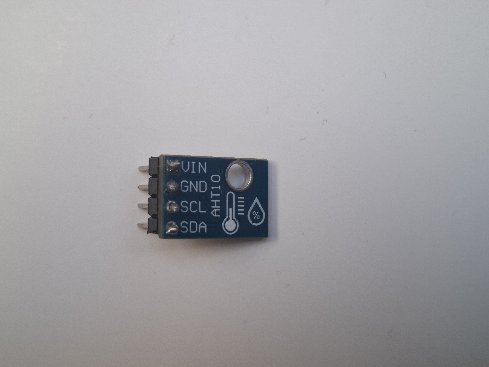

Nowoczesny, wysoce precyzyjny i miniaturowy czujnik przeznaczony do równoczesnego pomiaru **temperatury oraz wilgotności względnej powietrza**. Wyposażony w zaawansowany, skalibrowany fabrycznie chip ASIC oraz ulepszony pojemnościowy element sensorowy MEMS. 

Dzięki wbudowanemu konwerterowi poziomów logicznych oraz stabilizatorowi napięcia, moduł charakteryzuje się szerokim zakresem zasilania **od 1.8V do 5.0V**, co pozwala na bezproblemową współpracę z układami 3.3V (ESP32, Raspberry Pi) oraz 5V (Arduino UNO R4).

---

### Główne cechy i zalety
* **Wysoka stabilność i precyzja:** Czujnik oferuje fabryczną kalibrację i doskonałą stabilność długoterminową, co eliminuje potrzebę ręcznego dostrajania.
* **Szybki czas reakcji:** Zoptymalizowany algorytm pomiarowy zapewnia błyskawiczny odczyt danych środowiskowych.
* **Energooszczędność:** Pobiera znikome ilości prądu, zwłaszcza w trybie uśpienia (poniżej 0.25 µA), przez co idealnie sprawdza się w projektach zasilanych bateryjnie.
* **Prosty interfejs I2C:** Komunikacja za pomocą zaledwie dwóch linii (SDA i SCL) pozwala zaoszczędzić cenne piny mikrokontrolera.
* **Kompaktowe wymiary:** Płytka modułu zajmuje minimalną przestrzeń, ułatwiając montaż w ciasnych obudowach projektów DIY.

---

### Specyfikacja techniczna

| Parametr | Zakres / Wartość | Dokładność |
| :--- | :--- | :--- |
| **Zakres pomiaru wilgotności** | 0% - 100% RH | ± 2% RH (w temp. 25°C) |
| **Zakres pomiaru temperatury**| -40°C do +85°C | ± 0.3°C |
| **Napięcie zasilania (VCC)** | 1.8V - 5.5V DC | — |
| **Interfejs komunikacyjny** | I2C (Serial Data & Clock) | — |
| **Stały adres I2C** | 0x38 | — |
| **Pobór prądu (pomiar)** | ok. 23 µA | — |
| **Pobór prądu (uśpienie)** | 0.25 µA | — |
| **Rozdzielczość pomiarowa** | 20-bit (dla temperatury i wilgotności) | — |

---

### Opis wyprowadzeń (Pinout)

Moduł posiada standardowe złącze kołkowe (goldpin) o skoku 2.54 mm z 4 pinami:

* **VIN (VCC)** – Zasilanie modułu w zakresie od 1.8V do 5.5V DC.
* **GND** – Masa układu (wspólna z masą mikrokontrolera).
* **SCL** – Linia zegarowa magistrali I2C.
* **SDA** – Linia danych magistrali I2C.

---

### ⚠️ Wskazówki programistyczne i eksploatacyjne

1. **Konflikt adresów I2C:** Czujnik AHT10 ma przypisany **sztywny adres I2C równy `0x38`**, którego nie można zmienić programowo ani zlutowaniem padów. Jeśli planujesz podłączyć kilka takich samych czujników do jednego Arduino, musisz skorzystać z multipleksera I2C (np. TCA954