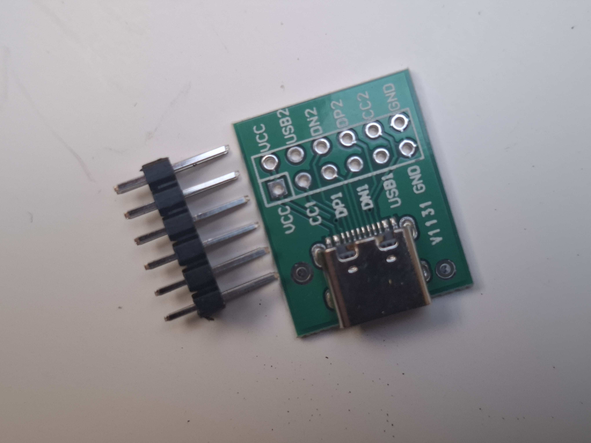

### Gniazdo USB-C – Port Żeński 12-pin DIP do montażu na PCB

Kompaktowe i niezwykle wytrzymałe złącze żeńskie **USB typu C** przeznaczone do montażu na płytkach drukowanych (PCB). Ta wersja złącza została zaprojektowana w hybrydowym układzie **DIP (Dual In-line Package)**, co oznacza, że piny sygnałowe są przystosowane do klasycznego **montażu przewlekanego**. 

W przeciwieństwie do standardowych złączy USB-C w wersji SMD (montaż powierzchniowy), wersja 12-pin DIP jest znacznie łatwiejsza do przylutowania w warunkach domowych, co czyni ją idealnym wyborem do projektów DIY, prototypowania oraz napraw uszkodzonych portów zasilania w elektronice użytkowej.

---

### Główne cechy i zalety
* **Łatwe lutowanie (Wersja DIP):** Piny przechodzą przez otwory w płytce PCB, dzięki czemu lutowanie nie wymaga specjalistycznej stacji na gorące powietrze (Hot-Air) – wystarczy zwykła lutownica kolbowa.
* **Wysoka wytrzymałość mechaniczna:** Płytka złącza posiada dodatkowe, grube metalowe nóżki (pady ekranujące), które przylutowuje się do laminatu. Zapewnia to doskonałe mocowanie i zapobiega wyrwaniu gniazda podczas częstego wpinania i wypinania kabla.
* **Symetryczna konstrukcja USB-C:** Pozwala na wkładanie wtyku w dowolną stronę (brak ryzyka odwrotnego podłączenia zasilania).
* **Zoptymalizowana konfiguracja 12-pin:** Złącze wyprowadza kluczowe piny zasilania oraz podstawowe piny transmisji danych (USB 2.0), odrzucając zbędne, trudne do polutowania piny linii wysokich prędkości (USB 3.0+).

---

### Specyfikacja techniczna

| Parametr | Wartość / Opis |
| :--- | :--- |
| **Typ złącza** | USB Typ C (żeński / port / gniazdo) |
| **Ilość pinów** | 12 pinów sygnałowych + piny montażowe korpusu |
| **Typ montażu** | THT / DIP (przewlekany) |
| **Maksymalne napięcie pracy**| 20V DC |
| **Maksymalny prąd (VBUS)** | do 3A |
| **Rezystancja styków** | max. 40 mΩ |
| **Rezystancja izolacji** | min. 100 MΩ |
| **Trwałość mechaniczna** | min. 10 000 cykli wpięcia |

---

### 💡 Ważna wskazówka dotycząca zasilania (Rezystory CC)

Jeśli używasz tego gniazda w celu **zasilania własnego projektu** (np. chcesz zastąpić stare gniazdo micro-USB nowym USB-C) i podłączasz urządzenie do inteligentnej ładowarki USB-C lub Powerbanku PD za pomocą kabla USB-C do USB-C, musisz zastosować dwa rezystory:

> Aby ładowarka/źródło "zrozumiała", że podłączono odbiornik prądu i podała napięcie 5V na linię VBUS, należy przylutować **dwa niezależne rezystory $5.1\ \text{k}\Omega$** – jeden pomiędzy pin **CC1 a GND**, a drugi pomiędzy pin **CC2 a GND**. Bez tych rezystorów nowoczesne ładowarki nie aktywują zasilania (port pozostanie "martwy").

---

### Zastosowanie
* Modernizacja starych urządzeń (konwersja zasilania z Micro USB / Mini USB / DC Jack na nowoczesne USB-C).
* Projekty DIY i robotyka – budowa własnych płytek drukowanych (np. modułów zasilania do platform robotów).
* Serwis i naprawa urządzeń elektronicznych (wymiana uszkodzonych, wyłamanych gniazd ładowania).
* Wyprowadzenie portu zasilania i komunikacji na obudowę urządzenia.