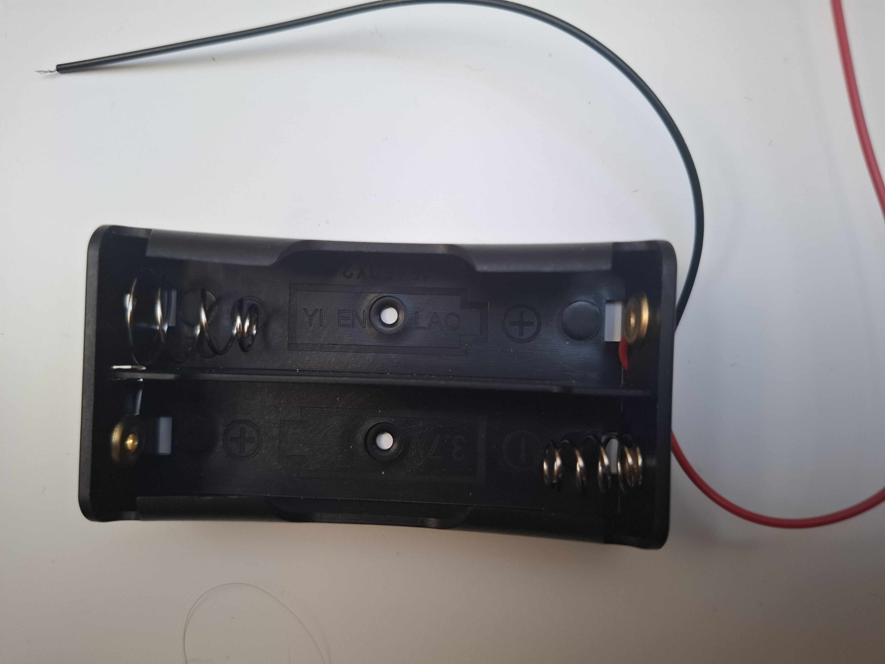

Klasyczny, wysokiej jakości uchwyt (koszyk) przeznaczony do montażu **dwóch ogniw litowo-jonowych (Li-Ion) typu 18650**. Moduł łączy ogniwa w sposób **szeregowy (2S)**, co pozwala uzyskać napięcie znamionowe 7.4V (oraz napięcie maksymalne 8.4V przy pełnym naładowaniu).

Koszyk jest podstawowym elementem zasilania w robotyce mobilnej oraz projektach DIY. Znakomicie współpracuje z opisanymi wcześniej komponentami, takimi jak platforma robota Mecanum, ładowarka 2S USB-C oraz mikrokontroler UNO R4.

---

### Główne cechy i zalety
* **Konfiguracja szeregowa (2S):** Sumuje napięcie obu ogniw ($3.7V + 3.7V = 7.4V$), co jest idealną wartością do zasilania sterowników silników (np. L298N) oraz stabilizatorów w mikrokontrolerach.
* **Wyprowadzone przewody:** Posiada fabrycznie przylutowane, elastyczne przewody o długości ok. 15 cm z odizolowanymi końcówkami, gotowe do wpięcia w złącza śrubowe lub przylutowania.
* **Otwory montażowe:** W dnie obudowy znajdują się otwory pozwalające na pewne przykręcenie koszyka śrubami do aluminiowej ramy robota lub innej obudowy.
* **Wytrzymały materiał:** Wykonany z czarnego tworzywa sztucznego odpornego na uderzenia i wysokie temperatury.
* **Mocne sprężyny:** Zastosowanie stalowych sprężyn gwarantuje doskonały docisk ogniw oraz brak przerw w zasilaniu podczas drgań i ruchu robota.

---

### Specyfikacja techniczna

| Parametr | Wartość / Opis |
| :--- | :--- |
| **Typ kompatybilnych ogniw**| 18650 (Li-Ion / Litowo-jonowe) |
| **Ilość miejsc na ogniwa** | 2 |
| **Konfiguracja połączenia**| Szeregowa (2S) |
| **Napięcie znamionowe** | 7.4V |
| **Napięcie maksymalne** | 8.4V (po pełnym naładowaniu) |
| **Wyprowadzenia** | 2 przewody (Czerwony = Plus, Czarny = Minus) |
| **Długość przewodów** | ok. 13 - 15 cm |
| **Materiał obudowy** | Tworzywo sztuczne (ABS / Plastik) |
| **Kolor** | Czarny |
| **Wymiary gabarytowe** | ok. 75 mm x 40 mm x 20 mm |

---

### ⚠️ Ważne wskazówki dotyczące bezpieczeństwa i użytkowania

1. **Ryzyko zwarcia (Bardzo Ważne):** Ogniwa 18650 potrafią oddać ogromny prąd w ułamku sekundy. **Nigdy nie dopuść do zetknięcia się ze sobą odizolowanych końcówek przewodów (czerwonego i czarnego)**, gdy w koszyku znajdują się baterie! Może to doprowadzić do stopienia plastiku, uszkodzenia ogniw, a w skrajnych przypadkach do pożaru.
2. **Polaryzacja:** Na dnie każdego slotu w koszyku wytłoczone są symbole plusa `(+)` i minusa `(-)`. Zawsze wkładaj ogniwa zgodnie z tymi oznaczeniami. W konfiguracji 2S jedno ogniwo będzie włożone plusem w jedną stronę, a drugie odwrotnie.
3. **Ogniwa z zabezpieczeniem (Protected) vs bez (Unprotected):** Koszyk pasuje idealnie do standardowych, przemysłowych ogniw 18650 z płaskim plusem (flat top). Ogniwa z wbudowanym elektronicznym zabezpieczeniem PCB (button top) są o 2-3 mm dłuższe i mogą wchodzić do koszyka bardzo ciasno, wyginając blaszki stykowe.

---

### Idealne dopasowanie do Twojego projektu