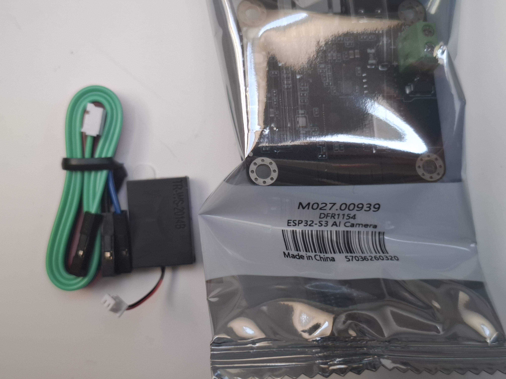

Zaawansowana, zintegrowana płytka rozwojowa stworzona z myślą o projektach sztucznej inteligencji, widzenia komputerowego (**Edge AI**) oraz Internetu Rzeczy (IoT). Moduł oparty jest na potężnym, dwurdzeniowym mikrokontrolerze **ESP32-S3** (z obsługą instrukcji wektorowych przyspieszających sieci neuronowe) i został wyposażony w sensor optyczny **OV3660** o rozdzielczości **2 MPx** oraz obiektyw o szerokim kącie widzenia.

Dzięki natywnej łączności **Wi-Fi i Bluetooth**, dużej pamięci PSRAM oraz wsparciu dla frameworków takich jak ESP-WHO (rozpoznawanie twarzy) czy ESP-DL (głębokie uczenie), moduł ten pozwala na uruchamianie algorytmów sztucznej inteligencji bezpośrednio „na krawędzi” (on-device), bez konieczności ciągłego przesyłania obrazu do chmury.

---

### Główne cechy i zalety
* **Układ ESP32-S3 z akceleracją AI:** Dwurdzeniowy procesor Xtensa 32-bit LX7 z taktowaniem do 240 MHz posiada dedykowane wsparcie dla operacji maszynowych i przetwarzania sygnałów.
* **Sensor OV3660 2 MPx:** Oferuje rozdzielczość do 1600 x 1200 px, co zapewnia wyraźny obraz i znacznie lepsze rezultaty w algorytmach rozpoznawania obiektów niż starsze sensory (np. OV2640).
* **Duży zasób pamięci:** Wyposażony w pamięć PSRAM, która jest kluczowa przy buforowaniu klatek obrazu o wysokiej rozdzielczości podczas przetwarzania przez algorytmy AI.
* **Komunikacja bezprzewodowa:** Zintegrowane Wi-Fi 2.4 GHz (802.11 b/g/n) oraz Bluetooth 5 (LE) umożliwiają łatwy streaming wideo oraz zdalne sterowanie urządzeniem.
* **Kompatybilność z ekosystemem DFRobot:** Płytka posiada wyprowadzenia i interfejsy ułatwiające integrację z innymi peryferiami (czujnikami, sterownikami silników) w robotyce.

---

### Specyfikacja techniczna

| Parametr | Wartość / Opis |
| :--- | :--- |
| **Producent / Kod** | DFRobot / DFR1154 |
| **Główny kontroler** | ESP32-S3 (Dual-core 32-bit ARM/Xtensa LX7) |
| **Taktowanie procesora**| do 240 MHz |
| **Sensor kamery** | OV3660 (2 Megapiksele) |
| **Maksymalna rozdzielczość**| 1600 x 1200 px |
| **Kąt widzenia obiektywu**| Szerokokątny (FOV) |
| **Łączność** | Wi-Fi 2.4 GHz + Bluetooth 5.0 LE (z anteną na PCB / złączem IPEX) |
| **Napięcie zasilania** | 5V DC (przez USB-C lub piny zasilania) |
| **Interfejsy programowania**| USB-C |
| **Wsparcie dla AI** | Rozpoznawanie twarzy, detekcja obiektów, rozpoznawanie gestów, kategoryzacja obrazu |

---

### 🧠 Zastosowanie w Edge AI i Twoim projekcie

Moduł ten idealnie uzupełnia opisywane wcześniej komponenty i może pełnić funkcję „oczu” dla Twojej zaawansowanej platformy mobilnej:

1. **Wizualne śledzenie obiektów (Object Tracking):** Zamontowanie tej kamery na **uchwycie Pan-Tilt z serwami SG90** pozwala stworzyć autonomiczne stanowisko monitoringu, które fizycznie obraca się za wykrytym człowiekiem, twarzą lub określonym przedmiotem.
2. **Sterowanie robotem przez gesty:** Przetwarzając obraz bezpośrednio na ESP32-S3, możesz zaprogramować robota (z mostkiem L298N i kołami Mecanum) tak, aby reagował na gesty dłoni pokazywane do kamery (np. podniesiona dłoń = STOP, ruch w prawo = jazda krabem w prawo).
3. **Autonomiczny transport (AGV):** Kamera może być użyta do zaawansowanego rozpoznawania znaków drogowych, strzałek kierunkowych lub kodów QR na podłodze, sterując ruchem platformy 4WD w przestrzeni magazynowej.

---

### ⚠️ Wskazówki programistyczne i uruchomieniowe

* **Zarządzanie energią:** Przetwarzanie algorytmów AI oraz jednoczesna transmisja wideo przez Wi-Fi generują bardzo duży pobór prądu (impulsowo nawet powyżej 500mA). Podczas testów zasilaj moduł dobrej jakości kablem USB-C, a w robocie użyj wydajnego źródła (np. **przetwornicy LM2596** podpiętej do **koszyka 2S z ogniwami 18650 LG F1HR**).
* **Konfiguracja w Arduino IDE / ESP-IDF:** Przy programowaniu w Arduino IDE należy wybrać płytkę z rodziny ESP32-S3 (np. *ESP32S3 Dev Module*) oraz upewnić się, że w opcjach menu aktywowana została funkcja **PSRAM (OPI PSRAM lub QSPI PSRAM)**. Bez włączenia PSRAM próba uruchomienia kamery w wyższej rozdzielczości zakończy się błędem pamię