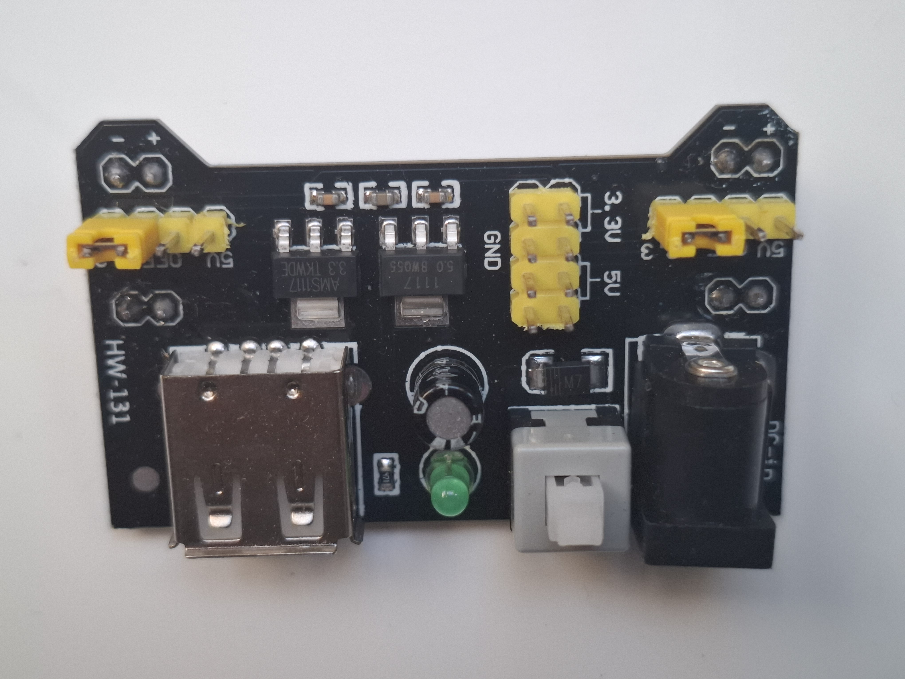

### Moduł Zasilania Płytki Stykowej MB-102 (USB, 3.3V - 5V)

Dedykowany moduł zasilacza stworzony z myślą o współpracy z najpopularniejszą płytką stykową **MB-102** (830 oraz 400 otworów). Konstrukcja płytki została zaprojektowana tak, aby dolne piny (goldpiny) idealnie wpinkiwały się w boczne szyny zasilające płytki stykowej, eliminując potrzebę prowadzenia plątaniny przewodów.

Moduł ten pozwala na jednoczesne i niezależne dystrybuowanie napięcia **3.3V** oraz **5V** na dwie osobne linie zasilające płytki stykowej, co jest kluczowe w projektach łączących układy o różnej logice (np. 5V dla Arduino UNO R4 i 3.3V dla żyroskopu MPU-6050).

---

### Główne cechy i zalety
* **Idealne dopasowanie:** Rozstaw pinów wyjściowych jest perfekcyjnie zestrojony ze standardem szyn zasilających płytki MB-102.
* **Niezależna konfiguracja linii:** Za pomocą dwóch zestawów zworek (jumperów) można ustawić napięcie dla każdej z dwóch bocznych szyn płytki stykowej z osobna (3.3V, 5V lub całkowicie odciąć zasilanie - OFF).
* **Trzy źródła zasilania:** Moduł można zasilić za pomocą klasycznego wtyku DC 5.5/2.1mm, portu USB lub bezpośrednio z pinów.
* **Wyjście USB Typu A:** Wbudowany port USB może działać jako **wyjście zasilania**, pozwalając na wyprowadzenie 5V np. do zasilenia dodatkowego mikrokontrolera.
* **Wbudowany wyłącznik:** Fizyczny przycisk ON/OFF pozwala na błyskawiczne odłączenie zasilania od całego prototypu bez konieczności wyciągania kabli.
* **Dioda LED statusu:** Zielona lub czerwona dioda sygnalizuje poprawną pracę i obecność napięcia w układzie.

---

### Specyfikacja techniczna

| Parametr | Wartość / Opis |
| :--- | :--- |
| **Kompatybilność** | Płytki stykowe typu MB-102 (szerokość standardowa) |
| **Napięcie wejściowe (Gniazdo DC)**| DC 6.5V - 12V (rekomendowane np. zasilacz sieciowy lub koszyk 2S 18650) |
| **Napięcie wyjściowe** | 3.3V lub 5V DC (wybierane zworkami) |
| **Maksymalny prąd wyjściowy** | < 700 mA (wbudowane stabilizatory liniowe AMS1117) |
| **Złącza wejściowe** | Gniazdo DC 5.5/2.1 mm, Port USB Typ A (wejście/wyjście) |
| **Wymiary modułu** | 53 mm x 32 mm |

---

### Opis konfiguracji zworek (Jumpers)

Na płytce znajdują się dwa zestawy potrójnych pinów oznaczonych jako `3.3V / OFF / 5V`. Przełożenie żółtej zworki w odpowiednią pozycję determinuje napięcie na powiązanej szynie płytki stykowej:

* **Zworka w pozycji 5V:** Na danej szynie zasilającej (plus i minus) otrzymujesz napięcie 5V.
* **Zworka w pozycji 3.3V:** Na danej szynie zasilającej otrzymujesz napięcie 3.3V.
* **Zworka w pozycji środkowej (OFF) / zdjęta:** Dana szyna boczna jest całkowicie odcięta od zasilania.

---

### ⚠️ Ważne wskazówki dotyczące użytkowania

1. **Zasilanie przez USB