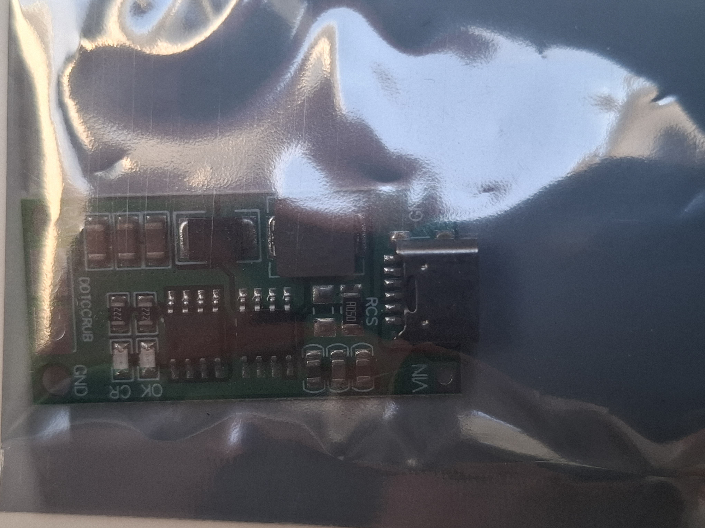

### Moduł Ładowarki Ogniw Li-Ion 18650 2S 2A USB-C

Wydajny i kompaktowy moduł ładowarki przeznaczony do pakietów składających się z **dwóch ogniw litowo-jonowych (Li-Ion) połączonych szeregowo (2S)**. Urządzenie zostało wyposażone w nowoczesny port **USB-C** oraz inteligentny układ podwyższający napięcie (Step-Up), co pozwala na ładowanie pakietu 2S (napięcie końcowe 8.4V) ze standardowego źródła USB 5V.

---

### Główne cechy i zalety
* **Uniwersalne zasilanie USB-C:** Możliwość ładowania za pomocą popularnych ładowarek do telefonów, portów USB w komputerze czy powerbanków.
* **Wbudowana przetwornica Step-Up:** Automatycznie podbija napięcie wejściowe 5V do poziomu wymaganego przez pakiet 2S.
* **Wysoki prąd ładowania:** Prąd o natężeniu do 2A zapewnia szybkie i efektywne uzupełnianie energii.
* **Sygnalizacja LED:** Diody na płytce na bieżąco informują o stanie pracy (ładowanie / pełne naładowanie).
* **Automatyczne zarządzanie procesem ładowania:** Bezpieczny algorytm CC/CV (Constant Current / Constant Voltage).

---

### Specyfikacja techniczna

| Parametr | Wartość / Opis |
| :--- | :--- |
| **Typ ogniw** | Litowo-jonowe (Li-Ion) / Litowo-polimerowe (Li-Poly) |
| **Konfiguracja pakietu** | 2S (2 ogniwa połączone szeregowo, np. 18650) |
| **Złącze wejściowe** | USB typ C |
| **Napięcie wejściowe** | DC 3V - 6V (zalecane DC 3.7V - 5.5V) |
| **Napięcie naładowania** | 8.4V (± 1%) |
| **Maksymalny prąd ładowania** | 2A |
| **Sprawność konwersji** | do 90% |
| **Wskaźnik LED** | Czerwona/Niebieska (w zależności od rewizji: ładowanie / koniec ładowania) |
| **Temperatura pracy** | -40°C do +85°C |

---

### Opis wyprowadzeń (Solder Pads)
* **VIN+ / VIN-** – Alternatywne punkty lutownicze dla napięcia wejściowego (jeśli nie chcesz korzystać ze złącza USB-C).
* **BAT+** – Plus pakietu akumulatorów (8.4V).
* **BAT-** – Minus pakietu akumulatorów (GND).

> ⚠️ **Ważna uwaga dotycząca bezpieczeństwa:** Moduł ten służy **wyłącznie do ładowania** pakietu. Nie posiada on wbudowanego układu zabezpieczającego przed nadmiernym rozładowaniem (BMS) ani balansera. Do bezpiecznej eksploatacji pakietu 2S zaleca się stosowanie zewnętrznego modułu BMS 2S pomiędzy ładowarką a ogniwami.

---

### Zastosowanie
* Budowa i regeneracja pakietów zasilających w elektronarzędziach.
* Zasilanie modeli RC.
* Projekty DIY i robotyka (np. zasilanie mikrokontrolerów Arduino, ESP32, Raspberry Pi wymagających wyższego napięcia).
* Przenośne głośniki Bluetooth i powerbanki 8.4V.