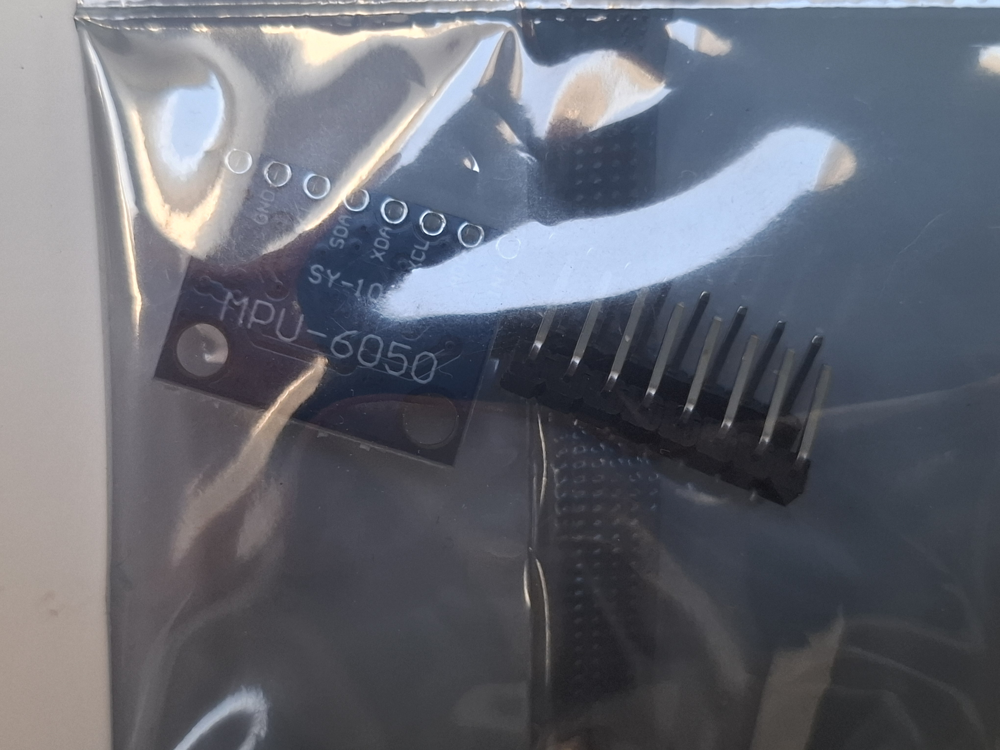

Niezwykle popularny i precyzyjny moduł czujnika inertnego (IMU) typu **6-DOF** (6 stopni swobody). Łączy w sobie **3-osiowy akcelerometr** oraz **3-osiowy żyroskop** w jednym układzie scalonym. Dzięki zintegrowanemu procesorowi ruchu **DMP (Digital Motion Processor)**, moduł potrafi samodzielnie wykonywać złożone obliczenia algorytmów fuzji czujników, odciążając główny mikrokontroler (np. Arduino, ESP32 czy Raspberry Pi).

Płytka **GY-521** posiada wbudowany stabilizator napięcia, co umożliwia bezpieczną pracę z systemami zasilanymi zarówno napięciem 3.3V, jak i 5V.

---

### Główne cechy i zalety
* **6 stopni swobody (6-DOF):** Pełny pomiar przyspieszenia liniowego w osiach X, Y, Z oraz prędkości kątowej (obrotu) wokół tych osi.
* **Cyfrowy Procesor Ruchu (DMP):** Umożliwia obliczanie orientacji przestrzennej (kąty Roll/Pitch/Yaw) bezpośrednio na układzie MPU-6050, minimalizując błędy dryftu żyroskopu.
* **Interfejs komunikacyjny I2C:** Prosta, dwuprzewodowa komunikacja z mikrokontrolerami (piny SDA i SCL).
* **Wbudowany przetwornik ADC:** 16-bitowe przetworniki analogowo-cyfrowe dla każdego kanału zapewniają wysoką czułość i dokładność pomiarów.
* **Wbudowany czujnik temperatury:** Pozwala na kompensację temperaturową odczytów oraz monitorowanie warunków pracy modułu.

---

### Specyfikacja techniczna

| Parametr | Wartość / Opis |
| :--- | :--- |
| **Układ scalony** | MPU-6050 (na płytce GY-521) |
| **Napięcie zasilania (VCC)** | 3.3V - 5V DC (wbudowany stabilizator LDO) |
| **Napięcie linii sygnałowych** | 3.3V (piny są tolerancyjne na 5V przy zasilaniu z 5V) |
| **Zakres akcelerometru** | Konfigurowalny: ±2g, ±4g, ±8g, ±16g |
| **Zakres żyroskopu** | Konfigurowalny: ±250, ±500, ±1000, ±2000 °/s |
| **Rozdzielczość pomiaru** | 16-bit dla każdej osi |
| **Interfejs** | I2C (częstotliwość do 400 kHz) |
| **Adres I2C** | 0x68 (domyślny) lub 0x69 (gdy pin AD0 podłączony do VCC) |
| **Wymiary płytki** | 20 mm x 15 mm |

---

### Opis wyprowadzeń (Pinout)

* **VCC** – Zasilanie modułu (3.3V - 5V).
* **GND** – Masa układu (wspólna z mikrokontrolerem).
* **SCL** – Linia zegarowa magistrali I2C (Serial Clock).
* **SDA** – Linia danych magistrali I2C (Serial Data).
* **XDA** – Zewnętrzna linia danych I2C (do podłączenia dodatkowego czujnika, np. magnetometru).
* **XCL** – Zewnętrzna linia zegarowa I2C.
* **AD0** – Wybór adresu I2C (stan niski = 0x68, stan wysoki = 0x69).
* **INT** – Wyjście przerwania (informuje mikrokontroler, np. o gotowości nowych danych lub wykryciu wstrząsu).

---

### ⚠️ Wskazówki dotyczące użytkowania i kalibracji

1. **Kalibracja (Offsets):** Każdy egzemplarz MPU-6050 ma fabryczne przesunięcia (offsety). Przed użyciem robota lub urządzenia należy położyć czujnik na idealnie płaskiej powierzchni i uruchomić program kalibrujący (dostępny w bibliotekach takich jak *MPU6050_tockn* lub *I2Cdev*), aby zresetować wskazania do wartości `0` dla osi X i Y oraz `1g` dla osi Z.
2. **Filtracja sygnału:** Surowe dane z akcelerometru są podatne na wibracje (np. od silników w platformie 4WD), a dane z żyroskopu dryfują w czasie. Aby uzyskać stabilny odczyt kąta pochylenia, zaleca się stosowanie **Filtru Komplementarnego** lub **Filtru Kalmana** (często wbudowanego w gotowe biblioteki).

---

### Zastosowanie
* **Stabilizacja dronów i modeli RC:** Kluczowy komponent systemów typu Flight Controller (np. MultiWii, Cleanflight).
* **Balansujące roboty:** Pojazdy dwukołowe typu *Self-Balancing Robot*, wymagające natychmiastowej reakcji na zmianę kąta nachylenia.
* **Kontrolery gestów i opaski fitness:** Wykrywanie kroków, upadków oraz rotacji dłoni.
* **Gimbale:** Systemy aktywnej stabilizacji aparatów i kamer.