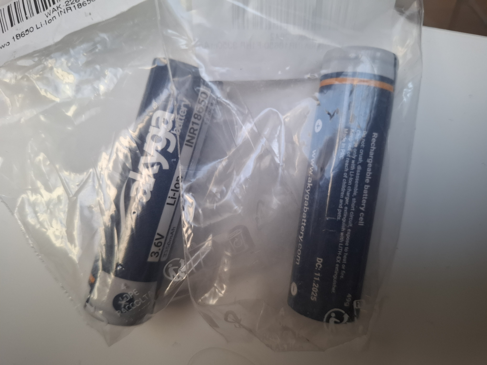

Wysokiej jakości, oryginalne ogniwo przemysłowe typu **18650** o bardzo wysokiej gęstości energii, wyprodukowane przez renomowaną firmę **LG Chem**. Model **F1HR** charakteryzuje się imponującą pojemnością nominalną wynoszącą **3350 mAh**, co czyni go jednym z najwydajniejszych ogniw w tym formacie dostępnych na rynku.

Ogniwo to posiada płaski plus (**Flat Top**) i nie ma wbudowanego elektronicznego zabezpieczenia (jest to ogniwo niezabezpieczone - **Unprotected**). Doskonale współpracuje z opisanym wcześniej *Koszykiem 2S* oraz *Ładowarką ogniw 2S USB-C*, stanowiąc potężny fundament zasilania dla platformy robota 4WD Mecanum.

---

### Główne cechy i zalety
* **Ekstremalna pojemność:** 3350 mAh zapewnia maksymalnie długi czas pracy robota, drona czy innego urządzenia DIY bez konieczności częstego ładowania.
* **Chemia INR (LiNiCoAlO2):** Wykorzystanie niklu, manganu i kobaltu gwarantuje optymalny kompromis pomiędzy wysoką pojemnością, bezpieczeństwem a stabilnością napięciową pod obciążeniem.
* **Płaski plus (Flat Top):** Idealnie pasuje do fabrycznych koszyków baterii 18650 oraz ułatwia zgrzewanie ogniw w większe pakiety za pomocą taśmy niklowej.
* **Niska rezystancja wewnętrzna:** Zapewnia mniejsze straty energii i mniejsze nagrzewanie się ogniwa podczas pracy.

---

### Specyfikacja techniczna

| Parametr | Wartość / Opis |
| :--- | :--- |
| **Producent** | LG Chem |
| **Model** | INR18650-F1HR |
| **Format** | 18650 |
| **Technologia** | Litowo-jonowa (Li-Ion / INR) |
| **Pojemność nominalna** | 3350 mAh |
| **Pojemność minimalna** | 3250 mAh |
| **Napięcie znamionowe** | 3.63V - 3.7V |
| **Napięcie maksymalne (ładowania)**| 4.2V (± 0.05V) |
| **Napięcie minimalne (odcięcia)** | 2.5V (granica rozładowania) |
| **Standardowy prąd ładowania** | ok. 1.6A (0.5C) |
| **Maksymalny ciągły prąd rozładowania**| ok. 5A - 6.5A (zależnie od temperatury) |
| **Typ bieguna dodatniego** | Płaski (Flat Top) |
| **Zabezpieczenie elektroniczne** | Brak (Unprotected) |
| **Wymiary** | Średnica: 18.4 mm, Wysokość: 65.2 mm |
| **Waga** | ok. 49 g |

---

### ⚠️ Bardzo ważne zasady bezpieczeństwa (Przemysłowe ogniwo Li-Ion)

Ponieważ ogniwa te **nie posiadają wbudowanego układu zabezpieczającego (PCM/BMS)** przed przeładowaniem, nadmiernym rozładowaniem i zwarciem, należy bezwzględnie przestrzegać poniższych reguł:

1. **Stosuj zewnętrzny BMS:** Używając tych ogniw w koszyku 2S do zasilania robota, zawsze podłączaj je przez moduł **BMS 2S**. Układ ten odetnie zasilanie, gdy napięcie na którymkolwiek ogniwie spadnie poniżej 2.5V, chroniąc je przed nieodwracalnym uszkodzeniem chemicznym.
2. **Nigdy nie zwieraj styków:** Zwarcie plusa z