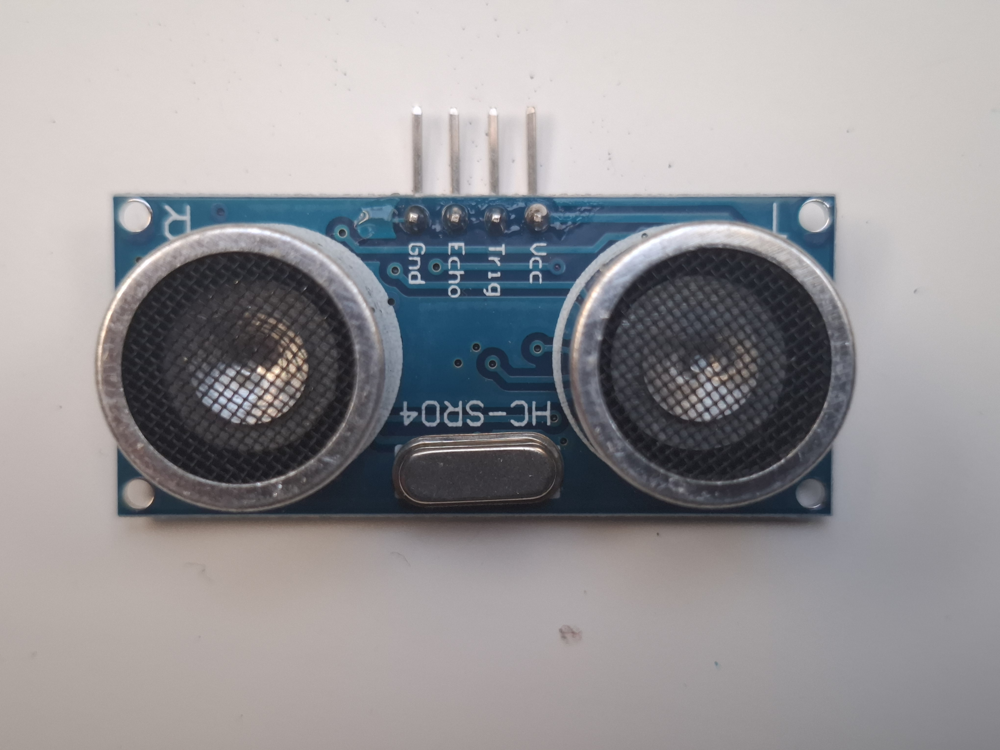

 
Niezwykle popularny, tani i łatwy w obsłudze czujnik przeznaczony do bezkontaktowego pomiaru odległości w zakresie **od 2 cm do 400 cm**. Działa na zasadzie sonarowej – wysyła falę ultradźwiękową o częstotliwości 40 kHz, która po odbiciu od przeszkody wraca do czujnika. 

Mierząc czas `t` między wysłaniem a odebraniem impulsu, mikrokontroler (np. Arduino, ESP32, Raspberry Pi) jest w stanie bardzo precyzyjnie obliczyć dystans do obiektu.

---

### Główne cechy i zalety
* **Wysoka dokładność:** Pozwala na pomiar odległości z dokładnością do 3 mm (w optymalnych warunkach).
* **Odporność na kolor i światło:** W przeciwieństwie do czujników optycznych (podczerwieni), kolor przeszkody oraz stopień doświetlenia otoczenia nie wpływają na wynik pomiaru.
* **Prosty interfejs:** Do obsługi wymagane są tylko 2 piny cyfrowe mikrokontrolera (Trigger oraz Echo).
* **Niski pobór prądu:** W stanie czuwania pobiera poniżej 2 mA, co czyni go idealnym do urządzeń zasilanych bateryjnie.

---

### Specyfikacja techniczna

| Parametr | Wartość / Opis |
| :--- | :--- |
| **Napięcie zasilania (VCC)** | 5V DC |
| **Pobór prądu w czasie pracy** | ok. 15 mA |
| **Pobór prądu w spoczynku** | < 2 mA |
| **Częstotliwość pracy** | 40 kHz |
| **Zakres pomiarowy** | 2 cm - 400 cm |
| **Kąt pomiaru (skuteczny)** | < 15° |
| **Sygnał wejściowy wyzwalający** | Impuls TTL o czasie trwania min. 10 µs |
| **Sygnał wyjściowy (Echo)** | Impuls TTL, którego czas trwania jest proporcjonalny do odległości |
| **Wymiary modułu** | 45 mm x 20 mm x 15 mm |

---

### Opis wyprowadzeń (Pinout)

* **VCC** – Zasilanie +5V DC.
* **Trig (Trigger)** – Pin wejściowy (służy do wyzwolenia pomiaru). Podanie stanu wysokiego (5V) przez co najmniej 10 mikrosekund inicjuje wysłanie serii fal dźwiękowych.
* **Echo** – Pin wyjściowy. Przechodzi w stan wysoki na czas powrotu fali. Długość trwania stanu wysokiego odzwierciedla czas podróży dźwięku.
* **GND** – Masa układu (GND).

---

### 📐 Jak obliczyć odległość? (Zasada działania)

1. Mikrokontroler wysyła impuls trwający 10 µs na pin **Trig**.
2. Czujnik automatycznie generuje i wysyła 8 impulsów dźwiękowych o częstotliwości 40 kHz.
3. Pin **Echo** przechodzi w stan wysoki (`HIGH`) w momencie wysłania fali i wraca do stanu niskiego (`LOW`), gdy fala odbita powróci do odbiornika.
4. Mierzymy czas trwania stanu wysokiego na