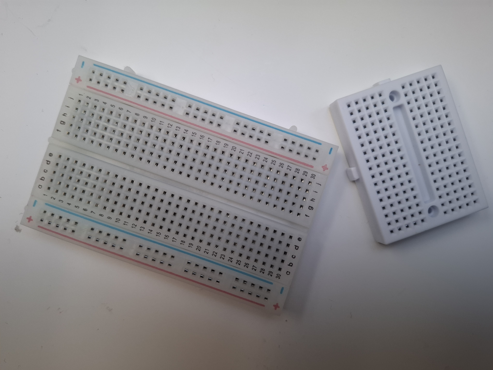

Niezbędne narzędzie w każdym warsztacie elektronicznym, umożliwiające **błyskawiczne i bezlutowe** budowanie, testowanie oraz modyfikowanie obwodów elektronicznych. Zamiast trwałego łączenia elementów lutownicą, komponenty (rezystory, diody, czujniki) oraz przewody połączeniowe Dupont wciska się bezpośrednio w otwory płytki.

Pod plastikową obudową znajdują się specjalne, sprężyste blaszki przewodzące (zazwyczaj niklowane lub fosforobrązowe), które pewnie zaciskają się na nóżkach elementów, gwarantując prawidłowy kontakt elektryczny.

---

### Główne cechy i zalety
* **Szybkie prototypowanie:** Możliwość natychmiastowej wymiany uszkodzonego elementu lub zmiany konfiguracji pinów w kilka sekund.
* **Wielokrotny użytek:** Te same komponenty i ta sama płytka mogą być wykorzystywane w setkach różnych projektów.
* **Standardowy raster (skok):** Otwory są rozmieszczone w siatce o rozstawie **2.54 mm (0.1")**, co jest absolutnym standardem w świecie elektroniki (idealnie pasuje do układów scalonych, Arduino, ESP32 oraz goldpinów).
* **Modułowość:** Większość płytek posiada na bocznych krawędziach specjalne zatrzaski (pióro-wpust), które pozwalają na łączenie kilku płytek w jedną, wielką platformę roboczą.

---

### 🧬 Anatomia i wewnętrzne połączenia płytki

Płytka stykowa (np. najpopularniejszy model MB-102 o 830 otworach) dzieli się na dwie główne sekcje:

#### 1. Szyny Zasilające (Boczne linie wzdłuż płytki)
* Oznaczone zazwyczaj **czerwoną linią (+)** oraz **niebieską/czarną linią (-)**.
* Blaszki pod spodem łączą otwory **wzdłuż (pionowo na powyższym schemacie)**, tworząc długie, jednolite linie zasilania.
* Służą do wygodnego rozprowadzania napięcia (np. 5V i GND z Arduino) do wszystkich elementów w projekcie.
* *Uwaga:* W długich płytkach (830 otworów) szyny zasilające bywają fabrycznie rozdzielone w połowie długości (przerwa w kolorowych liniach). Aby zasilić całą długość, należy połączyć je małą zworą z drutu.

#### 2. Obszar Prototypowy (Środkowe rzędy otworów)
* Otwory są ponumerowane (np. 1-60) i oznaczone literami (A-B-C-D-E oraz F-G-H-I-J).
* Blaszki łączą otwory **w poprzek (poziomo)**, w 5-pinowe paski (np. otwory A, B, C, D, E z rzędu nr 1 są ze sobą połączone).
* **Środkowy rowek rozdzielający:** Rozdziela kolumny A-E od F-J (brak połączenia elektrycznego). Jest on zaprojektowany specjalnie pod szerokość układów scalonych (DIP).