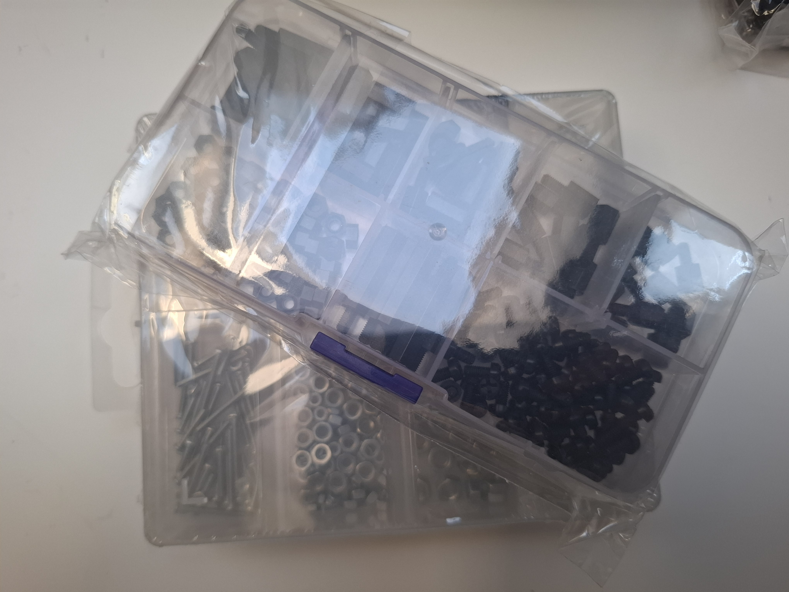

Podstawowy zestaw elementów złącznych oznaczonych symbolem **M** (metryczne), będący fundamentem montażowym w mechanice, robotyce oraz pracach serwisowych. W przeciwieństwie do opisanego wcześniej zestawu nylonowego, elementy metalowe (stalowe) są przeznaczone do przenoszenia **dużych obciążeń mechanicznych**, zapewniając maksymalną sztywność i trwałość konstrukcji.

Zestaw ten idealnie nadaje się do skręcania elementów konstrukcyjnych robota – mocowania silników z metalowymi przekładniami, łączenia aluminiowych elementów ramy platformy 4WD oraz mocowania cięższych podzespołów, takich jak uchwyty ramion robotycznych czy obudowy akumulatorów.

---

### Główne komponenty zestawu i ich rola

#### 1. Śruby metryczne (np. M2, M3, M4)
Główne elementy łączące, charakteryzujące się naciętym gwintem o znormalizowanym skoku. W projektach DIY najczęściej spotyka się śruby z **łbem walcowym na klucz imbusowy (heksagonalny)** lub **krzyżakowy (PH/PZ)**, co zapewnia wygodny montaż w trudno dostępnych miejscach.

#### 2. Nakrętki sześciokątne (Standardowe i Samohamowne)
* **Standardowe:** Klasyczne nakrętki, które wymagają mocnego dokręcenia lub zastosowania podkładki sprężystej, aby nie odkręciły się pod wpływem drgań.
* **Samohamowne (z wkładką poliamidową):** Posiadają wewnątrz pierścień z tworzywa, który blokuje gwint. Są **absolutnie kluczowe w robotyce mobilnej**, ponieważ zapobiegają samoczynnemu rozkręcaniu się konstrukcji podczas jazdy robota po nierównej powierzchni.

#### 3. Podkładki (Płaskie i Sprężyste)
* **Płaskie:** Zwiększają powierzchnię docisku nakrętki lub łba śruby do podłoża. Chronią delikatne materiały (np. pleksi, plastik z druku 3D, aluminium) przed zmiażdżeniem lub porysowaniem.
* **Sprężyste (oraz ząbkowane):** Działają jak miniaturowa sprężyna, wywierając stały nacisk na łeb śruby, co drastycznie utrudnia jej poluzowanie się pod wpływem wibracji generowanych przez silniki DC.

---

### Specyfikacja techniczna i oznaczenia

| Parametr | Wartość / Opis |
| :--- | :--- |
| **Typ gwintu** | Metryczny (ISO) |
| **Najpopularniejsze rozmiary DIY** | M2, M2.5, M3, M4 |
| **Materiał wykonania** | Stal węglowa (często ocynkowana) lub stal nierdzewna (A2 / A4) |
| **Klasa twardości (opcjonalnie)**| 4.8, 8.8 (im wyższa liczba, tym większa wytrzymałość stali) |
| **Powłoka ochronna** | Ocynk galwaniczny (zabezpiecza przed korozją) |

---

### 📐 Ściąga z wymiarów gwintów metrycznych

Warto pamiętać, jakie otwory należy przygotować w konstrukcji (np. wiertłem lub w projekcie 3D) pod dany gwint:

* **M2** – Średnica zewnętrzna gwintu: 2.0 mm |