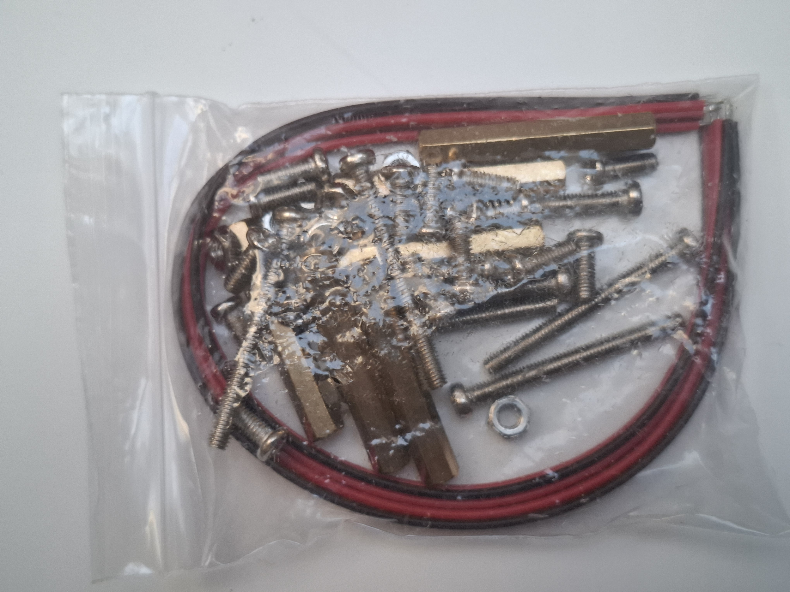

### Zestaw Nylonowych Śrubek, Nakrętek i Tulei Dystansowych M3

Niezbędny zestaw montażowy dla każdego konstruktora robotów, elektronika i pasjonata druku 3D. Zawiera komplet elementów gwintowanych w standardzie **M3** wykonanych z trwałego, czarnego lub białego **nylonu**. 

W przeciwieństwie do klasycznych śrub metalowych, elementy nylonowe są **całkowicie nieprzewodzące prądu**, dzięki czemu idealnie nadają się do bezpiecznego montażu płytek drukowanych (takich jak Arduino UNO R4, sterownik L298N, wyświetlacz LCD czy moduł kamery ESP32-S3) bezpośrednio na podwoziu robota bez ryzyka przypadkowego zwarcia ścieżek sygnałowych.

---

### Główne cechy i zalety
* **Izolacja elektryczna:** Tworzywo sztuczne gwarantuje 100% ochrony przed zwarciami elektrycznymi pomiędzy łbem śruby a elementami SMD na płytce PCB.
* **Niska waga:** Elementy nylonowe są wielokrotnie lżejsze od stalowych, co ma kluczowe znaczenie w robotach mobilnych (platformy 4WD) oraz modelach latających (drony, samoloty RC).
* **Odporność na korozję i chemię:** Nylon nie rdzewieje i jest odporny na działanie olejów, smarów oraz większości domowych chemikaliów.
* **Wielowariantowość tulei (Dystansów):** Tuleje typu **Męsko-Żeńskie (M-F)** oraz **Żeńsko-Żeńskie (F-F)** pozwalają na wygodne tworzenie konstrukcji piętrowych (np. montaż płytki stykowej lub Arduino dokładnie nad sterownikiem silników).
* **Łatwość obróbki:** W razie potrzeby nylonową śrubkę lub dystans można bardzo łatwo dociąć na wymaganą długość przy użyciu zwykłych szczypiec bocznych lub nożyka.

---

### Zawartość typowego zestawu organizera M3

Zestawy są zazwyczaj pakowane w poręczne, plastikowe organizery z przegródkami i zawierają:

1. **Tuleje dystansowe Żeńsko-Żeńskie (F-F):** Gwintowane z obu stron w środku (np. o długościach 6mm, 10mm, 15mm, 20mm).
2. **Tuleje dystansowe Męsko-Żeńskie (M-F):** Z jednej strony posiadają gwint zewnętrzny (wtyk), z drugiej wewnętrzny (gniazdo).
3. **Śrubki nylonowe M3:** Z łbem krzyżakowym lub walcowym (najczęściej o długości gwintu 6mm i 12mm).
4. **Nakrętki M3:** Klasyczne sześciokątne nakrętki z nylonu.
5. **Podkładki M3:** Chronią laminat płytki drukowanej przed zarysowaniem podczas dokręcania.

---

### Specyfikacja techniczna

| Parametr | Wartość / Opis |
| :--- | :--- |
| **Średnica gwintu** | M3 (3 mm) |
| **Skok gwintu** | 0.5 mm (standardowy gwint metryczny) |
| **Materiał** | Nylon 66 (Poliamid) |
| **Klasa palności** | UL94 V-2 |
| **Temperatura pracy** | -20°C do +120°C |
| **Kolor** | Czarny lub naturalny biały/mleczny |

---

### 💡 Praktyczne wskazówki montażowe w robotyce

1. **Montaż płytek Arduino / ESP32:** Otwory montażowe w większości płytek deweloperskich są dostosowane dokładnie pod standard M3. Użycie nylonowego dystansu 6mm lub 10mm pod płytką unosi ją nad ramę robota, chroniąc ostre, polutowane piny od spodu przed dotykaniem metalowych elementów podwozia.
2. **Uważaj na siłę dokręcania:** Nylon ma doskonałe właściwości mechaniczne, ale nie jest stalą. Dokręcaj śrubki **z wyczuciem, przy użyciu lekkiej siły rąk**. Zbyt mocne dokręcenie śrubokrętem może zerwać drobny gwint M3 lub